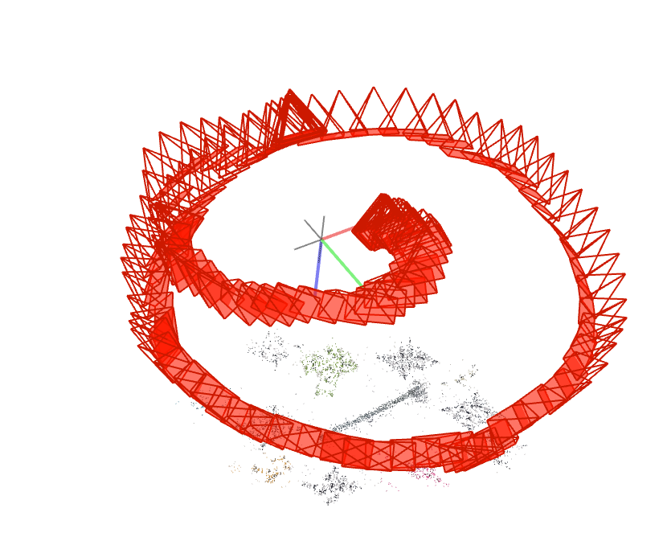
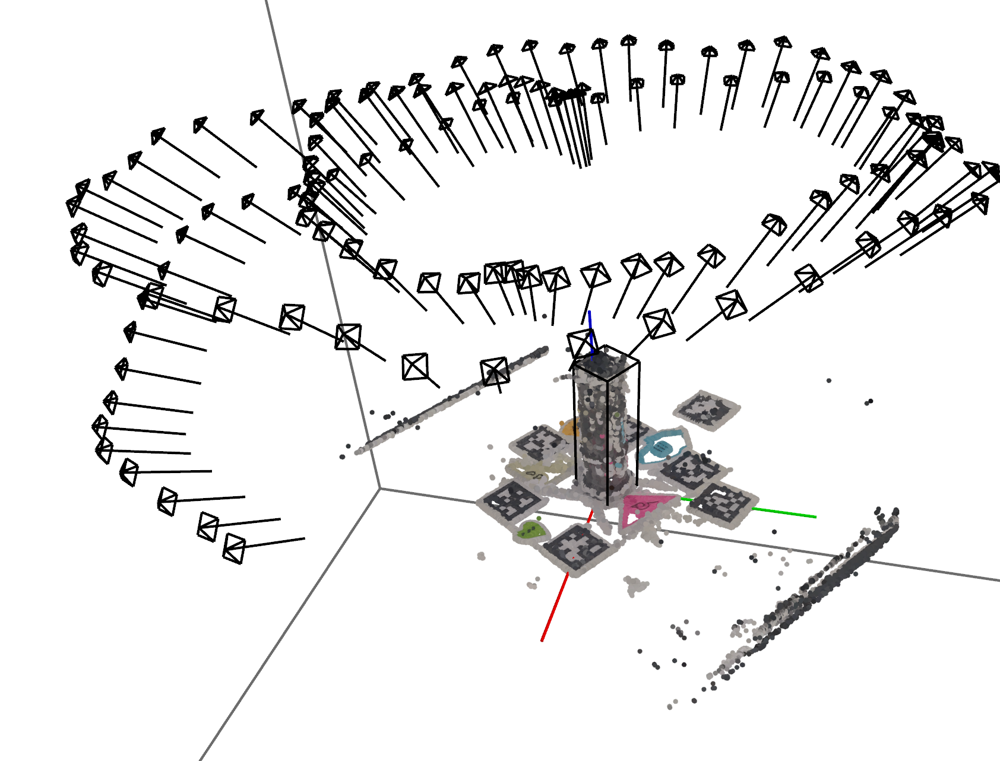
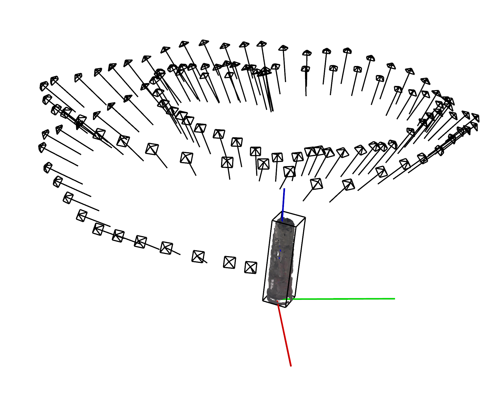
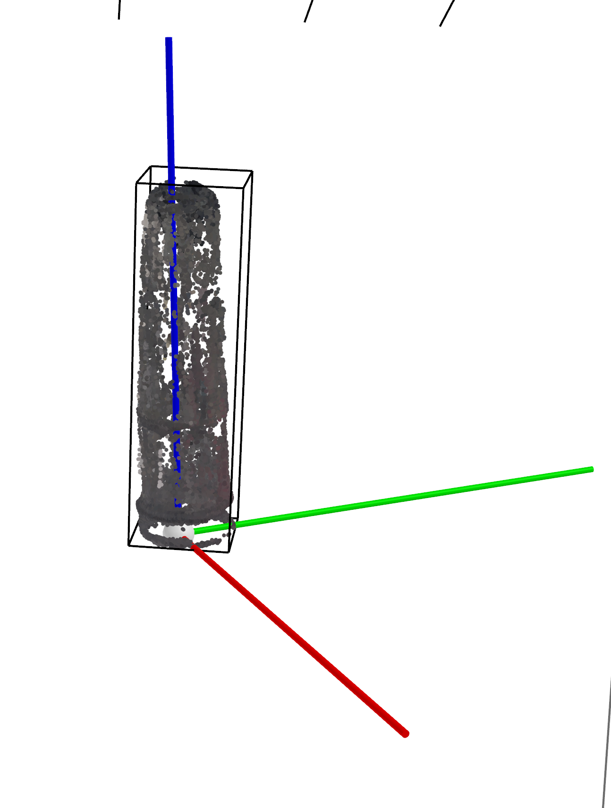

# 3D-Point-Cloud-Dataset-Generation
We created a pipeline to generate point cloud from a single RGB video of the object with the additional help of April tags.
- Input: RGB Video
- Ouput: 
    - Sampled Images
    - Object Mask
    - Point cloud (Just the Object)
    - Bounding box of the object

All the point clouds generated using the procedure will have the same coordinate system as long as the April tags (and their order) remain the same. The code cannot be uploaded at the moment.

## Capture Procedure
1. Place the object on top of a flat surface like a table
2. Place apriltags around the object.
    - The april tag have an associated number, keep track of the number
    - Measure the distance between apriltag, 
3. The object is to be placed at the center of the apriltags
4. Capture the video of the object such that the apriltag plus object is visible in most of the frames. 
    - The object is generally captured in a dome manner as shown
    - Be careful that the object does not get cut much
5. Refer to sample video in assets

  
Caption: Capture the object in a dome like manner. (The Red camera symbols denote camera position)

## Pipeline
- Video Capture
- Extract frames from the video and uniformly select frames to downsample
- Call COLMAP passing in the frames to get point cloud

  
Caption: Initial Point cloud estimation from COLMAP

- April tag detection
- Scale correction
- 3D point triangulation of center of april tag
    - Use the triangulated centers of April tag to estimate the plane equation of the table on which the object was placed
- Scene point removal
    - Estimate a mask for all the images using the LangSAM model with an associated text prompt
    - Back project the points to find out whether the points are inside the mask or not
    - Use a voting syste to determine which points are noisy
        - If we have a total of 50 images, and if the point is within the mask, say in 40 images, then we consider it as non-noisy
- Estimate the bounding box
- Orient the object along a global coordinate system. (The global coordinate system is found using the triangulated April tag location)

  
Final Point cloud of the object with the bounding box. The object shares a global coordinate system common to all objects captured using this system. 

